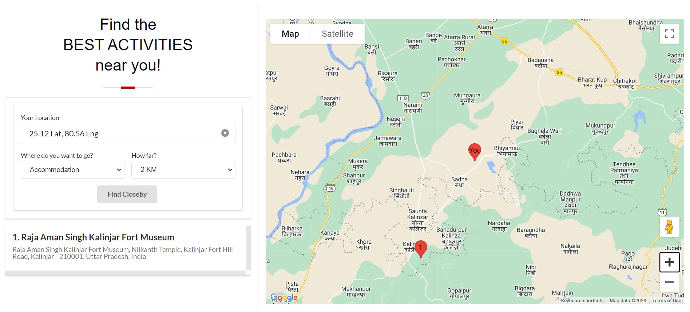
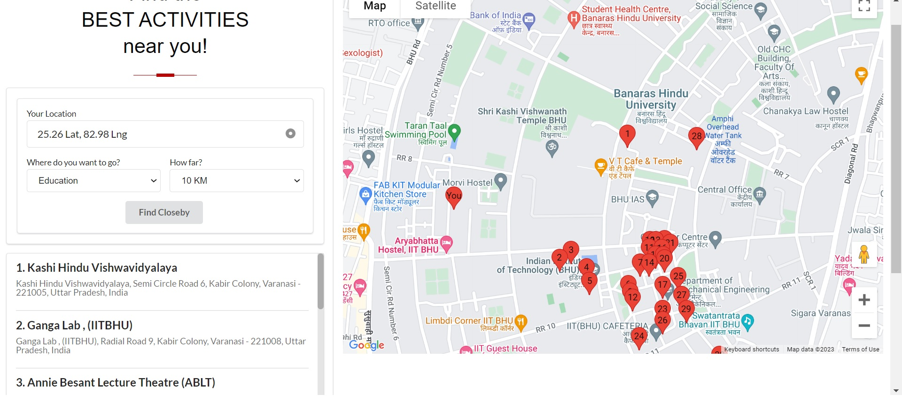

# PlaceFinder

A simple project which helps you to find activities todo near you!

### How to Use

1. Open the [deployed site here]() and click on the `Your Location` button to fetch your location.
2. Choose the `Type` of activity you want to do, and the `Distance` you are willing to travel for it.
3. Click `Find` and find the acitivites in your neighbourhood!

### Screenshots

### Techstack Used

- `Nuxt 3` for site development
- `Semantic UI` as the CSS framework
- `Google Maps Javascript API` for rendering the map
- `HTML 5's Geolocation API` to fetch the user's location
- `Geoapify's Places API` to fetch information about the places
